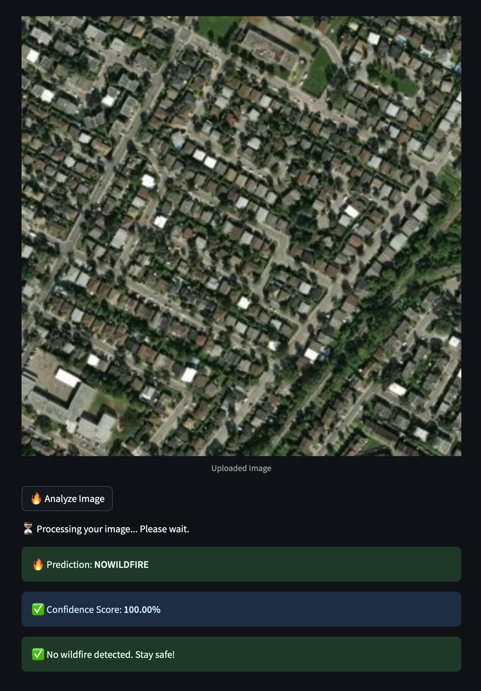
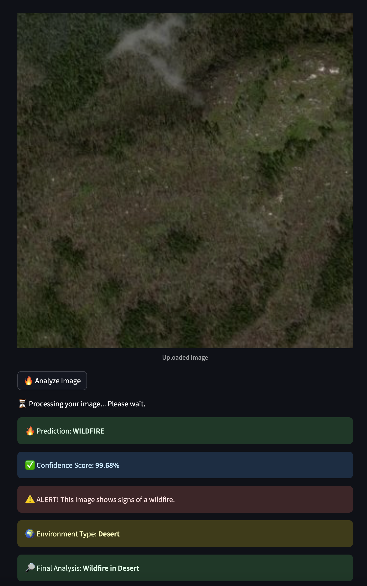

# EnviroClass

Exploring Environmental Patterns with Satellite Data

EnviroClass combines satellite imagery and machine learning to map and analyze environmental features, with a primary focus on predicting wildfires. Our project also classifies land cover types, including agricultural areas, forests, and urban regions. By offering a comprehensive view of the environment, EnviroClass enhances monitoring and supports better decision-making.

App: [EnviroClass](https://enviroclass.streamlit.app/)

  
  

## Tech Stack
- **Programming Languages**: Python
- **Models**: CNN, YOLO 11 OBB
- **Frameworks**: FastAPI, Streamlit
- **Tools**: Jupyter Notebooks, Kaggle Notebooks, Docker
- **Cloud Platforms**: Google Cloud

## Data
We use three curated Kaggle datasets for our analysis:
1. **[Wildfire Prediction Dataset](https://www.kaggle.com/datasets/abdelghaniaaba/wildfire-prediction-dataset)**: Includes images and data for wildfire detection.
2. **[Remote Sensing Satellite Images](https://www.kaggle.com/datasets/umeradnaan/remote-sensing-satellite-images)**: Contains high-resolution satellite images for land cover classification.
3. **[Satellite Image Classification Dataset](https://www.kaggle.com/code/nirmalgaud/satellite-images-classification)**: Provides labeled images for various land cover types.

## Contributors
- Bhupen Dabholkar [GitHub](https://github.com/bhupen-git) | [LinkedIn](https://www.linkedin.com/in/bhupen-dabholkar-1291221b2/)
- Franziska Haisch [GitHub](https://github.com/FranziskaHaisch) | [LinkedIn](www.linkedin.com/in/franziska-haisch-26125234b)
- Lukas Berger [GitHub](https://github.com/Luulyberg) | [LinkedIn](https://www.linkedin.com/in/lb341ab39a/)
- Therese Hempel [GitHub](https://github.com/Theresaurus) | [LinkedIn](http://www.linkedin.com/in/therese-hempel)

## Acknowledgements
We would like to thank the Kaggle community for providing the datasets used in this project. Special thanks to our mentors from LeWagon for their support and guidance throughout the development of EnviroClass.
